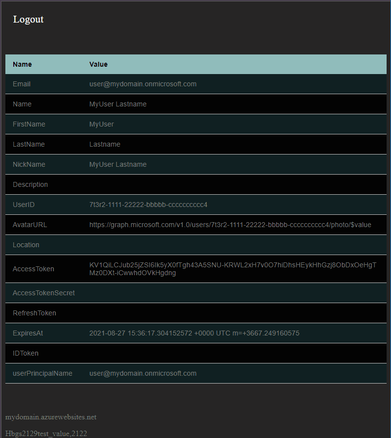

# tweb1
Example code using azure webapp + azure active directory authentication + gofiber app inside docker container.



# Web App Setup using Azure CLI
```bash
# https://docs.microsoft.com/en-us/cli/azure/install-azure-cli
# https://docs.microsoft.com/en-us/cli/azure/run-azure-cli-docker
# Using Docker: docker run -it mcr.microsoft.com/azure-cli
# ~$ sudo docker run --rm -it mcr.microsoft.com/azure-cli
# Unable to find image 'mcr.microsoft.com/azure-cli:latest' locally
# latest: Pulling from azure-cli
# 540db60ca938: Pull complete
# a7ad1a75a999: Pull complete
# 8d9a9d314bf5: Pull complete 
# Digest: sha256:2090963629cc9c595bbad24354bb6879112d8900000000000009
# Status: Downloaded newer image for mcr.microsoft.com/azure-cli:latest
# bash-5.1# az
# 
# Welcome to Azure CLI!
# ---------------------
# Use `az -h` to see available commands or go to https://aka.ms/cli.
# 
# Telemetry
# ---------
# The Azure CLI collects usage data in order to improve your experience.
# The data is anonymous and does not include commandline argument values.
# The data is collected by Microsoft.
# 
# You can change your telemetry settings with `az configure`.
# 
# 
#      /\
#     /  \    _____   _ _  ___ _
#    / /\ \  |_  / | | | \'__/ _\
#   / ____ \  / /| |_| | | |  __/
#  /_/    \_\/___|\__,_|_|  \___|
# 
# 
# Welcome to the cool new Azure CLI!
#
# this optional step, if you have more than one subscription, 
# you should set the default subscription, 
# which will be used for the remaining Azure CLI commands.
# ~$ az account set --subscription XXXXXXXX-XXXX-XXXX-XXXX-XXXXXXXXXXXX
#
export tenantId='XXXXXXXX-XXXX-XXXX-XXXX-XXXXXXXXXXXX'
export webAppName='tweb1app'
export resGroup='tweb1-resgrp'
export location='northeurope'
export servicePlan='tweb1-freeplan'
export tier='F1'
export containerImg='DOCKER|dockeruser/myrepo:tweb1'
export dockerUsr='dockeruser'
export dockerPass='xxxxxxxxxxx' 
#
az login --tenant $tenantId 
# bash-5.1# az login --tenant $tenantId
# Not able to launch a browser to log you in, falling back to device code...
# To sign in, use a web browser to open the page https://microsoft.com/devicelogin and enter the code DA5EFUFVL to authenticate.
#
# create new resource group
az group create --name $resGroup --location $location
# create new app service plan Free tier (sku:F1)
az appservice plan create -n $servicePlan -g $resGroup --sku $tier --is-linux
# create new web app (Note: as of 2021-08-28 this command can not configure private-docker-hub-conatiner image deployments so after this command you need to issue another config-container-set command to reach desired configuration.)
az webapp create -n $webAppName -g $resGroup -p $servicePlan -i $containerImg -s $dockerUsr -w $dockerPass --tags Lifecycle=Test
az webapp stop --name $webAppName --resource-group $resGroup
#
az webapp config container set --name $webAppName --resource-group $resGroup --docker-custom-image-name 'DOCKER|dockeruser/myrepo:tweb1' --docker-registry-server-url 'https://index.docker.io/v1' --docker-registry-server-user 'dockeruser' --docker-registry-server-password 'xxxxxxxxxxx'
#
az ad app create --display-name $webAppName --available-to-other-tenants false --key-type Password --password '111xxxxxxxxxxxx11_1111xxxx1x' --reply-urls 'https://tweb1app.azurewebsites.net/auth/azureadv2/callback'
#
az webapp stop --name $webAppName --resource-group $resGroup
# a custom startup command for docker container
az webapp config set --resource-group $resGroup --name $webAppName --startup-file '/tweb1 -k sample_param-value,1714'
# configure web app settings, get the value for APPLICATION_ID which you can find inside of resulted json output from `az ad create` command like: "appId": "XXXXXXXX-XXXX-XXXX-XXXX-XXXXXXXXXXXX"  
az webapp config appsettings set --resource-group $resGroup --name $webAppName --settings APPLICATION_ID='XXXXXXXX-XXXX-XXXX-XXXX-XXXXXXXXXXXX'
az webapp config appsettings set --resource-group $resGroup --name $webAppName --settings AD_TENANT_ID=$tenantId
az webapp config appsettings set --resource-group $resGroup --name $webAppName --settings REDIRECT_URI='https://tweb1app.azurewebsites.net/auth/azureadv2/callback'
az webapp config appsettings set --resource-group $resGroup --name $webAppName --settings MICROSOFT_PROVIDER_AUTHENTICATION_SECRET='111xxxxxxxxxxxx11_1111xxxx1x'
#
az webapp start --name $webAppName --resource-group $resGroup
```
